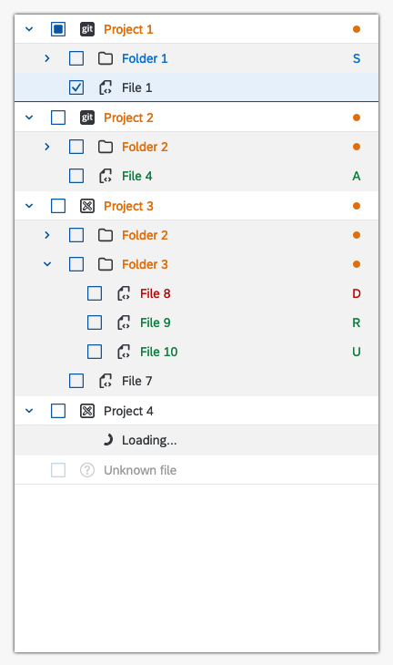
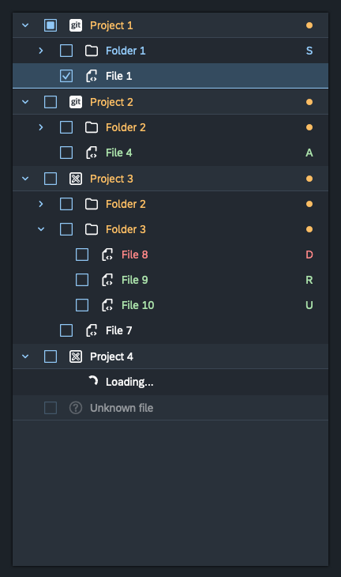

# Fiori theme for jstree




## How to see demo

Start a local server. For example:

```sh
python3 -m http.server
```

Then go to http://localhost:8000/ (replace the port with the correct one for other servers).

## Theme

The theme and it's resources are located in the fiori folder. It comes with two modes - "normal" and "compact". There is partial support for RTL.

You can use custom icons from SAP or Font Awesome but note that with this theme, they can only be a single color which will be the text color from the theme.

Include in your headers:

```html
<!-- SAP icons from Fundamental-styles -->
<link href="https://unpkg.com/fundamental-styles@0.21.1/dist/icon.css" rel="stylesheet" />
<!-- SAP theming. Replace 'sap_fiori_3' with 'sap_fiori_3_dark' for dark theme -->
<link
  href="https://unpkg.com/@sap-theming/theming-base-content@11.1.34/content/Base/baseLib/sap_fiori_3/css_variables.css"
  rel="stylesheet"
/>
<!-- The jstree theme itself -->
<link rel="stylesheet" href="fiori/fiori.css" />
<!-- Font settings -->
<link rel="stylesheet" href="demo.css" />
```

Activate it:

```javascript
$("#jstree_demo").jstree({
  core: {
    themes: {
      name: "fiori",
      variant: "compact", // remove for normal size
    },
  },
  plugins: ["indicator", "types", "wholerow"], // types and wholerow are necessary
  types: {
        "default": {
            icon: "sap-icon--question-mark"
        },
        file: {
            icon: "jstree-file"
        },
        folder: {
            icon: "jstree-folder"
        },
        project: {
            icon: "sap-icon--folder"
        },
        gitProject: {
            icon: "jstree-git"
        }
    },
});
```

Activate RTL:

```html
<div id="jstree_demo" style="direction:rtl"></div>
```

Make it fill both width and height:

```html
<div id="jstree_demo" class="jstree-fiori--fill"></div>
```

Leave extra space after the last row for right clicking and activating the context menu:

```html
<div id="jstree_demo" class="jstree-fiori--context-menu"></div>
```

## Indicator plugin

The indicator jstree plugin can only be used with the provided jstree fiori theme, SAP 72 font, SAP icons, SAP Theming, "wholerow" and "types" plugin.

You can activate it by including the `indicator.plugin.js` file and then adding "indicator" in the `plugins` jstree configuration list.

In order for it to work, you must include `added`, `modified`, `deleted`, `untracked`, `conflict`, `renamed` or `submodule` booleans to the `state` object of every node that requires it.

It also includes a sort functionality and when that functionality is enabled, using it with the "sort" plugin may give weird results. If you need to use the "sort" plugin, disable the sort in this plugin first.

Example configuration:

```javascript
$("#jstree_demo").jstree({
  plugins: ["indicator", "types", "wholerow"], // types and wholerow are necessary
  indicator: {
    sort: true, // Should it sort while creating the indicators
    customSort: function (firstNodeId, secondNodeId) {
      // custom sort function here
    },
    rowIndicator: function (element, node) {
      // custom indicator function here
    },
  },
});
```

Example data:

```javascript
{
    text: "Project 1",
    type: "project",
    children: [
        {
            text: "File 1",
            type: "file"
        },
        {
            text: "Folder 1",
            type: "folder",
            children: [
                {
                    text: "File 2",
                    type: "file",
                    state: { added: true },
                },
            ],
        },
    ],
}
```

Indicator letters and their meaning:

- A - Added (A new file has been added to the repository)
- M - Modified (An existing file has been changed)
- D - Deleted (The file has been deleted but the change has not been committed to the repository yet)
- U - Untracked (The file is new or has been changed but has not been added to the repository yet)
- C - Conflict (There is a conflict in the file on repository pull/merge)
- R - Renamed (The file has been renamed, the change has been added to the repository but has not been committed)
- S - Submodule (Indicates a repository that exists inside another repository)
- Colored dot - Folder/Project contains a file that has been changed

### Custom indicators

You can create your own custom indicators by passing your own custom function that will have control over each node.

Example:

```javascript
$("#jstree_demo").jstree({
  plugins: ["indicator", "types", "wholerow"],
  indicator: {
    rowIndicator: function (element, node) {
      // Custom stuff here
      // 'element' is the html node element
      // 'node' is the jstree node object
    },
  },
});
```
